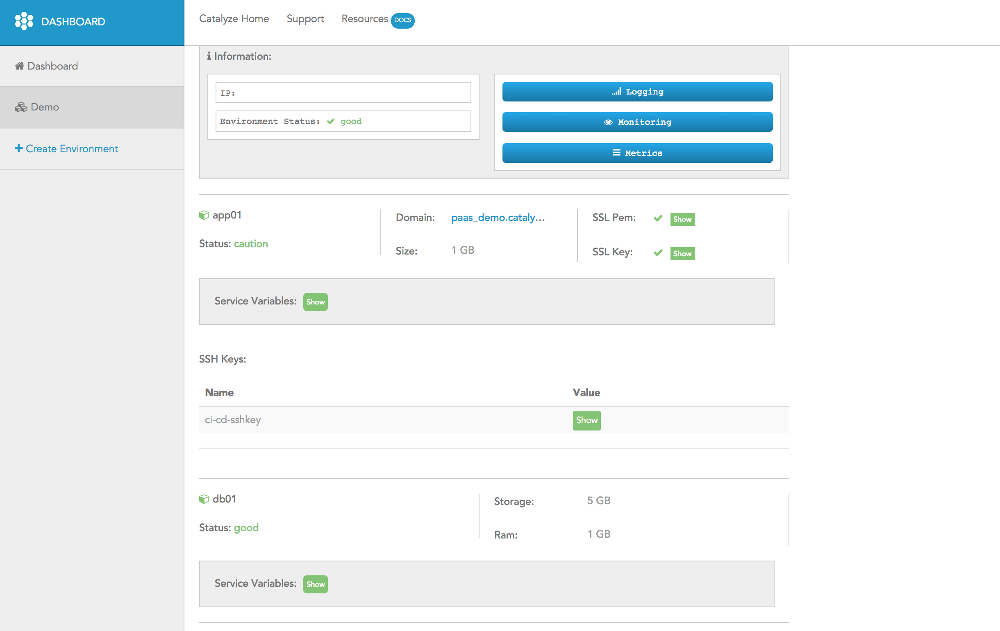

# Accessing the dashboard

> —

Login to the dashboard using the credentials you created earlier.

You will see a screen that looks something like this:

You can click on View (right next to the environment name) or the Overview link to the right to see a summary screen of the containers that have been deployed and their status.

You can click on the green show buttons next to each variable that you specified to see what you entered. Additionally, you can modify / add variables by clicking on the Update button next to each section (coming soon). Once you update them, the variables will come into effect the next time you do a git push and re-deploy your app.
