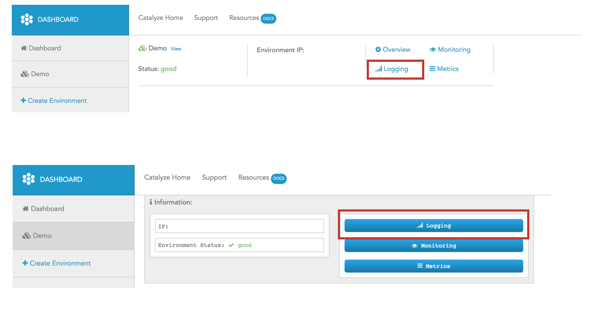

# Accessing your logging server

> —

Once you log into the dashboard, you can see the buttons for accessing you dedicated Logging containers next to you environment or from the Overview screen.

Click on the button (or link) and it will spawn a new window and you can view the logs from your application and environment there.

This is an extradordinarily powerful solution that we give to you and is worthwhile delving into a bit more detail.

