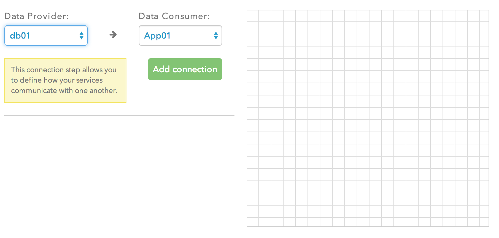
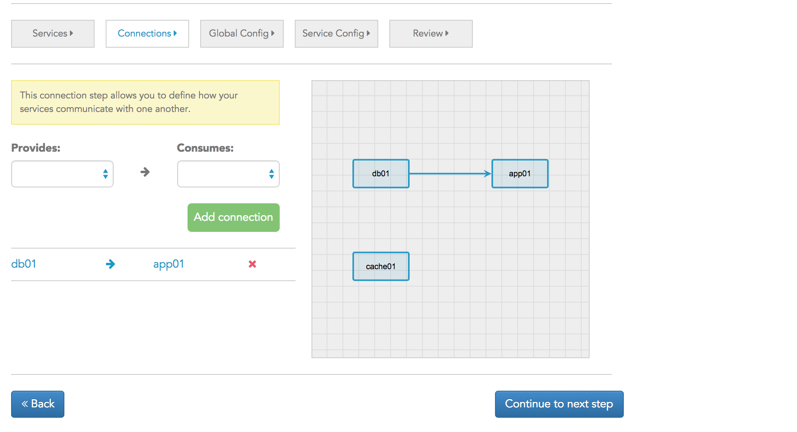
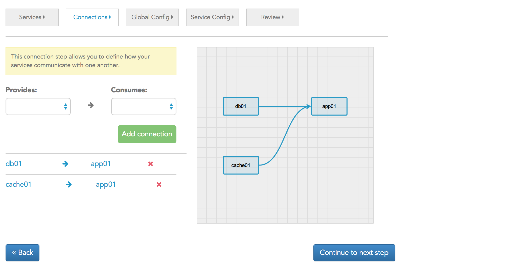
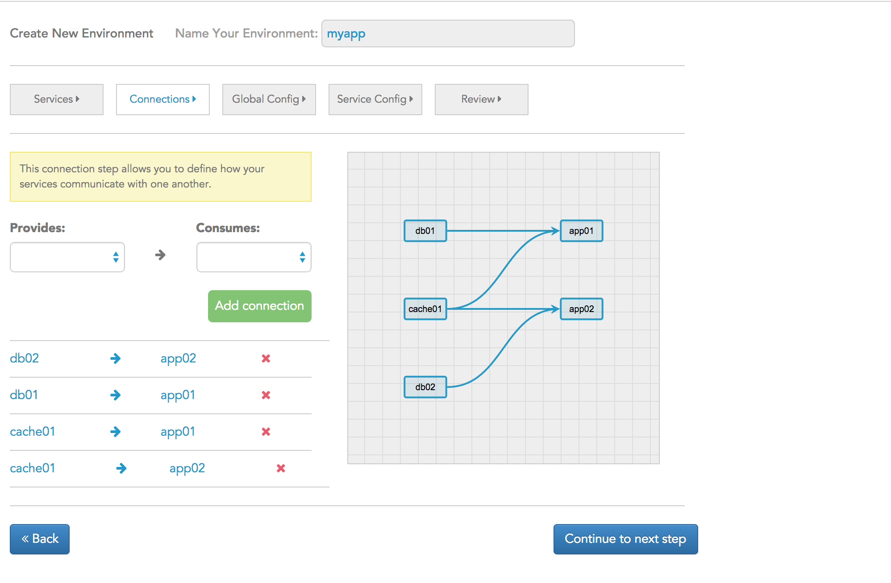

# Define connections between your containers

> The quality of the connections is the key to quality per se.

> — Charles Eames

Now that you have defined the various services within your environment, the next step is to tell the Catalyze PaaS how you would like them to be wired up. We ask you to make these connections explicitly so that we do not make assumptions on your behalf.

The convention we follow is data centric i.e. the store or source of data (e.g. database) **provides** data to the **consumer** of data (e.g. the application). So in the example that we've been working through, the PostgreSQL service provides data to the Ruby service. So you would select **db01** from the Data Provider drop down and **App01** from the Data Consumer dropdown. 

.

Click the Add Connection button and you will see the graphical view of the connection shown on the right and listed below as well.

.

If you make a mistake, delete the connection by clicking the red X next to the connection listing.

Similarly, you would configure additional connections between the app01 service and the memcache service. Memcache being the source of data would be the Data Provider and the App01 would be the Data Consumer. So at the end of this step, you would get a connection diagram and listing that looks like this.

.

If you had selected HA on the screens earlier, note that the HA "boxes" are represented as just *one* box. You don't have to explicitly define the connections between *all* the pairs.

So, if we had a complicated architecture which included *all* of the above services and connections, perhaps your screen would look something like this.

Once this has been done, you're ready to move on to defining environment specific variables, SSH keys and SSL certs.

