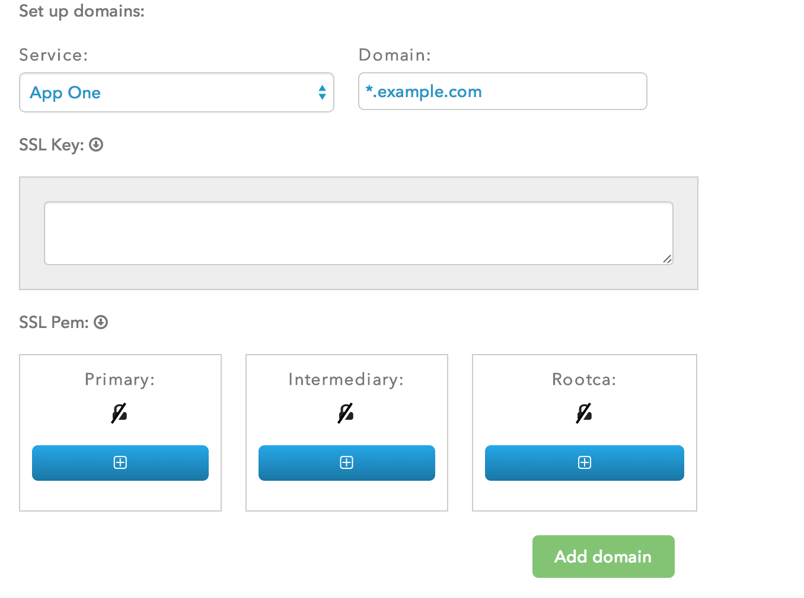

# Domain Names & SSL Certificates

> I don't get what my signature is supposed to mean if we haven't had some kind of exchange.

> — Nana Visitor

###Overview

Because of the unique nature of SSL validation, provisioning SSL for your application is a multi-step process that involves several third-parties. You will need to:
- Purchase an SSL certificate from your SSL provider
- SSL endpoints are provisioned by default by Catalyze
- Upload the cert to Catalyze
- Update your DNS settings to reference the new SSL Endpoint URL

Additional details and steps are available  [here](https://devcenter.heroku.com/articles/ssl-endpoint). [This Stack Overflow answer](http://serverfault.com/questions/9708/what-is-a-pem-file-and-how-does-it-differ-from-other-openssl-generated-key-file) might also provide some additional context around some of the terms used in this section. 

A couple of points to pay attention to:
- While generating the CSR, the Common Name field must match the secure domain **exactly**. If you buy a certificate for `example.com`, it won't match or secure `www.example.com`. So, if you want to deploy:
  - A single sub-domain such as `app01.example.com`, then buy a cert that matches that exactly
  - Multiple apps on different subdomains, specify the wildcard URL: `*.example.com`

To deploy and secure your apps on Catalyze, we need the following pieces of information that need to be pasted into the appropriate areas in the dashboard screenshow shown below.

- **URL / Domain name of the app**: As described above, you would use `app01.example.com` if you only intend to deploy the one app. If you intend to deploy several (dev, prod, qa etc.), you might choose to go with `*.example.com`
- **Corresponding SSL key**: Paste the SSL key into the section below.
- **SSL PEM**: You will also need the PEM for the Primary, Intermediate and RootCA authorities. Click on the green **+** below each of them and paste the values in there. Details on how to go about generating and getting the PEMs are available [here](https://www.digicert.com/ssl-support/pem-ssl-creation.htm).

After pasting the info above, click on the **Add Domain** button.
