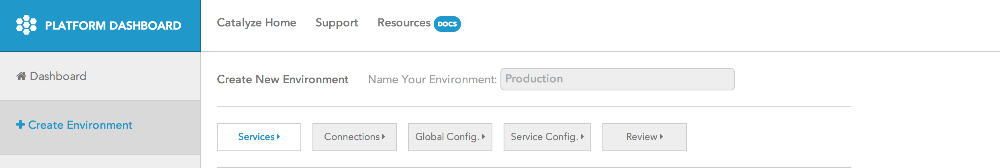
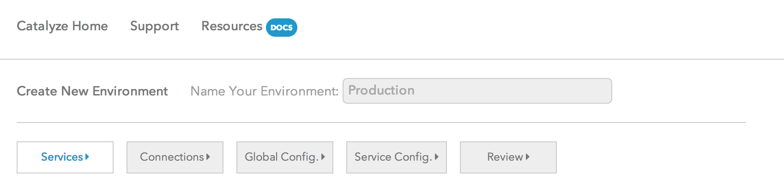

# Environment Name

> There are only two hard things in Computer Science: cache invalidation and naming things.

> — Phil Karlton

### Step 1: Click the Create Environment button on the left navbar

### Step 2: Name your environment

The environment name is the name by which you wish to call your specific app deployment. It is possible for you to have multiple deployments of the same app such as development, QA, production, etc. So you could have your environment name be `my_awesome_app_prod` or `My Awesome App-Production` . There are no constraints (as such) that we place upon what you call your app. We do recommend that you keep it relatively short and avoid using any special characters while naming it. We also, sincerely recommend that **if you have multiple environments, name each one of them uniquely** otherwise you will run into issues with the command line interface (CLI) and during support conversations.

Additionally, please note that you will be able to view all the environments that you have created on the left nav.

* We, internally, generate a UUID and associate that for all internal deployment identification.* 
